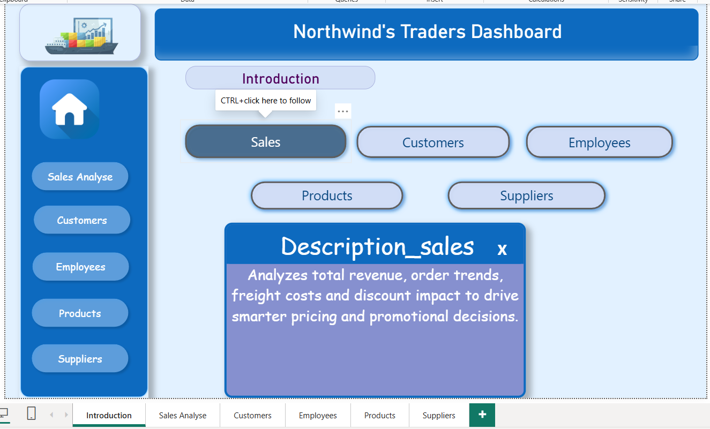
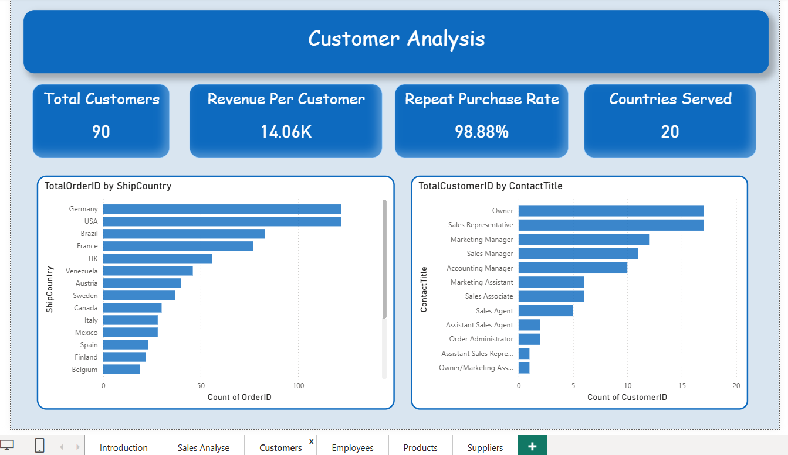
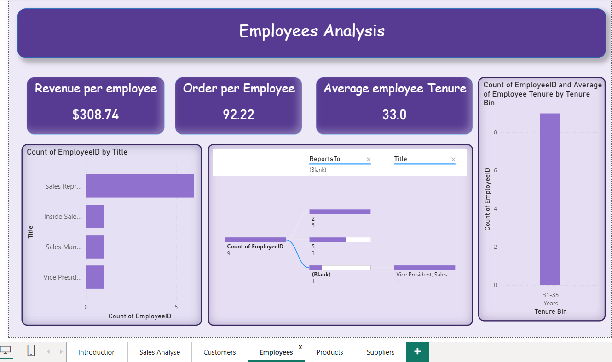
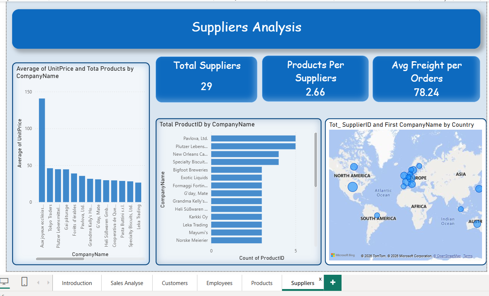

#  Northwind Traders — Sales Analysis Power BI Project

---

## 📌 Project Objective
The objective of this Power BI report is to create a visually appealing and user-friendly dashboard that communicates key performance metrics for 
**Northwind Traders** effectively. The report aims to generate insights into customer behavior, sales patterns, and employee performance to aid 
decision-making processes.

It will cover:
- 📊 Sales Analysis
- 👥 Customer Segmentation
- 📦 Products 
- 👔 Employee Performance

The report consolidates data from multiple tables for a comprehensive view of the company's operations. It will empower stakeholders to make 
**data-driven decisions** by offering valuable insights and facilitating data exploration through **interactive visualizations and dynamic filters**.

---

## 🏢 About the Company
The **Northwind database** contains the sales data for a fictitious company called **"Northwind Traders"** which imports and exports 
specialty foods from around the world. 
---

## 🗃️ Dataset Description

### 📋 Tables Used

| Table | Description |
|-------|-------------|
| **Customers** | Stores customer information including customer ID, company name, contact name, contact title, address, city, region, postal code, country, phone and fax |
| **Employees** | Stores employee details including employee ID, name, title, title of courtesy, birth date, hire date, address, city, region, country, home phone, extension, and reporting structure |
| **Orders** | Stores order information including order ID, customer ID, employee ID, order date, required date, shipped date, ship via, freight, ship name and shipping address details |
| **Order Details** | Stores detailed line items for each order including order ID, product ID, unit price, quantity and discount applied |
| **Products** | Stores product information including product ID, product name, supplier ID, category ID, quantity per unit, unit price, units in stock, units on order, reorder level and discontinuation status |
| **Suppliers** | Stores supplier information including supplier ID, company name, contact name, contact title, address, city, region, postal code, country, phone, fax and home page |
| **Shippers** | Stores shipping company details including shipper ID, company name and phone number |
| **Categories** | Stores product category information including category ID, category name and description |

---

## 📊 Dataset Statistics

| Metric | Value |
|--------|-------|
| **Total Orders** | 830+ |
| **Total Customers** | 91 |
| **Total Products** | 77 |
| **Total Employees** | 9 |
| **Total Suppliers** | 29 |
| **Total Categories** | 8 |
| **Countries Covered** | 21 |
| **Overall Revenue** | $1,265,793+ |

---

## 🧹 Data Cleaning 
- Validated primary and foreign key relationships across all tables
- Created `Revenue` column in order_details:
  `Revenue = UnitPrice × Quantity × (1 - Discount)`
- Created customer segments based on order count and total spend:
  - **High Value Repeat** : Orders ≥ 3 AND Spend ≥ 5000
  - **Repeat Customer** : Orders ≥ 3
  - **High Spend** : Spend ≥ 5000
  - **Regular** : All others
- Identified revenue anomalies using mean ± 2×StdDev method
- Analyzed seasonal demand trends by month and year
- Performed geographic and title-wise employee distribution analysis
- Analyzed supplier regional pricing and category distribution
- Validated all date fields — OrderDate, RequiredDate, ShippedDate

---

## 🛠️ Tools Used

| Tool | Purpose |
|------|---------|
| **MySQL** | Data extraction and EDA |
| **Power BI** | Data modeling and visualization |
| **Excel** | Data cleaning and hendeling nulls |
| **Problem solving** | Usefull Insights |

---

## 📊 Dashboard Pages

### 🛒 Page 1 — Sales Overview
> High-level summary of total revenue, orders and performance trends.

**KPIs:**
- Total Revenue | Total Orders | Avg Order Value | Total Customers


### 👥 Page 2 — Customer Analysis
> Customer segmentation, order patterns and geographic distribution.

**KPIs:**
- Total Customers | Avg Orders per Customer
- High Value Repeat Customers | Total Countries


### 📦 Page 3 — Product & Inventory Analysis
> Product performance, pricing, stock levels and seasonal demand.

**KPIs:**
- Total Products | Avg Unit Price
- Total Quantity Sold | Discontinued Products
---

### 👔 Page 4 — Employee Analysis
> Employee distribution by city, country, title and hire trends.

**KPIs:**
- Total Employees | Total Cities
- Avg Tenure (Years) | Sales Representatives Count
---

### 🏭 Page 5 — Supplier Analysis
> Supplier distribution by region, category and pricing trends.

**KPIs:**
- Total Suppliers | Avg Product Unit Price
- Total Countries Supplied | Total Categories Supplied
---

## 💡 Key Insights

- 🏆 **Beverages** is the top revenue category with **$267,868**
- 🥛 **Dairy Products** ranks 2nd in revenue at **$234,507**
- 🌍 **USA, Germany & France** are the top customer countries
- 👥 **High Value Repeat** customers drive the most revenue
- 📅 **January & February** show the strongest seasonal revenue peaks
- 🚨 Some products flagged as **revenue anomalies** (Too High / Too Low)
- 🌐 Most employees are based in **Seattle, USA**
- 🏪 **Australia** has the highest avg supplier unit price at **$33.83**
- 🔁 Majority of customers are classified as **Repeat Customers**
- 💰 **Overall Revenue** exceeds **$1.26M** across all categories


---

## 📸 Dashboard Preview

### Introduction


### 🛒 Sales Overview


### 👥 Customer Analysis


### 📦 Product & Inventory


### 👔 Employee Analysis


### 🏭 Supplier Analysis


---

## 👤 Author
- **Project** : Northwind Traders Sales Analysis
- **Tool** : Power BI , Excel, MySql
- **Dataset** : Northwind Traders Sample Database
```

